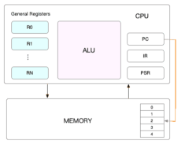

### 一、什么是CPU上下文切换

我们都知道，Linux 是一个多任务操作系统，它支持远大于 CPU 数量的任务同时运行。当然，这些任务实际上并不是真的在同时运行，而是因为系统在很短的时间内，将 CPU 轮流分配给它们，造成多任务同时运行的错觉。
而在每个任务运行前，CPU 都需要知道任务从哪里加载、又从哪里开始运行，也就是说，需要系统事先帮它设置好 CPU 寄存器和程序计数器（Program Counter，PC）。
CPU 寄存器，是 CPU 内置的容量小、但速度极快的内存。而程序计数器，则是用来存储 CPU 正在执行的指令位置、或者即将执行的下一条指令位置。它们都是 CPU 在运行任何任务前，必须的依赖环境，因此也被叫做 CPU 上下文。



> CPU上下文切换，就是先把前一个任务的 CPU 上下文（也就是 CPU 寄存器和程序计数器）保存起来，然后加载新任务的上下文到这些寄存器和程序计数器，最后再跳转到程序计数器所指的新位置，运行新任务。

保存下来的 CPU 上下文，会存储到系统内核中，等到任务重新调度执行时，再将内核保存的上下文加载到 CPU 中继续运行。


### 二、进程上下文切换

Linux 按照特权等级，把进程的运行空间分为内核空间和用户空间，分别对应着下图中， CPU 特权等级的 Ring 0 和 Ring 3。
内核空间（Ring 0）具有最高权限，可以直接访问所有资源；
用户空间（Ring 3）只能访问受限资源，不能直接访问内存等硬件设备，必须通过系统调用陷入到内核中，才能访问这些特权资源。

#### 系统调用
>系统调用过程通常称为特权模式切换，而不是上下文切换 

进程既可以在用户空间运行，又可以在内核空间中运行。进程在用户空间运行时，被称为进程的用户态，而陷入内核空间的时候，被称为进程的内核态。
从用户态到内核态的转变，需要通过系统调用
#### 系统调用存在CPU上下文切换
CPU 寄存器里原来用户态的指令位置，需要先保存起来。接着，为了执行内核态代码，CPU 寄存器需要更新为内核态指令的新位置。最后才是跳转到内核态运行内核任务。
而系统调用结束后，CPU 寄存器需要恢复原来保存的用户态，然后再切换到用户空间，继续运行进程。所以，一次系统调用的过程，其实是发生了两次 CPU 上下文切换

#### 进程上下文切换和系统调用区别
进程上下文切换，发生在进程的用户态和内核态之间，从一个进程到另一个进程。
+ 进程的上下文切换就比系统调用时多了一步：在保存当前进程的内核状态和 CPU 寄存器之前，需要先把该进程的虚拟内存、栈等保存下来；而加载了下一进程的内核态后，还需要刷新进程的虚拟内存和用户栈
+ 保存上下文和恢复上下文的过程并不是“免费”的，需要内核在 CPU 上运行才能完成

系统调用，则是发生在进程的内核态和内核态之间，一直在同一个进程中

#### 进程上下文切换的场景
+ 进程执行完毕，释放cpu,此时就绪队列取进程来运行
+ 资源不足时，进程处于挂起状态，会触发进程的切换
+ 进程通过sleep()等方法进入睡眠状态，也会触发进程的切换
+ 发生硬件中断时，CPU 需要切换到更高权限的内核态来处理中断

### 三、线程上下文切换

线程是独立调度的基本单位，但是线程之间共享进程的上下文信息
，因此，线程之间的切换，只是保存和恢复调用栈，比进程上下文切换要快得多。
#### 线程上下问切换分两种情况
一、前后两个线程属于不同进程。此时，因为资源不共享，所以切换过程就跟进程上下文切换是一样。

二、前后两个线程属于同一个进程。此时，因为虚拟内存是共享的，所以在切换时，虚拟内存这些资源就保持不动，只需要切换线程的私有数据、寄存器等不共享的数据。

> 到这里你应该也发现了，虽然同为上下文切换，但同进程内的线程切换，要比多进程间的切换消耗更少的资源，而这，也正是多线程代替多进程的一个优势。

### 四、中断上下文切换

为了快速响应硬件的事件，中断处理会打断进程的正常调度和执行，转而调用中断处理程序，响应设备事件。而在打断其他进程时，就需要将进程当前的状态保存下来，这样在中断结束后，进程仍然可以从原来的状态恢复运行。
跟进程上下文不同，中断上下文切换并不涉及到进程的用户态。所以，即便中断过程打断了一个正处在用户态的进程，也不需要保存和恢复这个进程的虚拟内存、全局变量等用户态资源。中断上下文，其实只包括内核态中断服务程序执行所必需的状态，包括 CPU 寄存器、内核堆栈、硬件中断参数等。

对同一个 CPU 来说，中断处理比进程拥有更高的优先级，所以中断上下文切换并不会与进程上下文切换同时发生


### 五、案例

#### 工具

**vmstat**

性能分析工具，可以分析CPU上下文切换和中断的次数

```
yum -y install sysstat
```

```
[root@xxx1 ~]# vmstat 1   1
procs -----------memory---------- ---swap-- -----io---- -system-- ------cpu-----
 r  b   swpd   free   buff  cache   si   so    bi    bo   in   cs us sy id wa st
 1  0      0 7218496   2108 536896    0    0    48    40  138 3925  0  4 95  0  0
[root@xxx1 ~]#
```

+ cs (context switch) : 每秒上下文切换的次数
+ in (interrupt): 每秒中断的次数
+ r (Running or Runnable) 就绪队列的长度，也就是正在运行和等待运行的进程数
+ b (Blocked) 处于不可中断睡眠的进程数

vmstat 只给出了系统总体的上下文切换情况,要想查看每个进程的详细情况，就需要使用我们前面提到过的 pidstat  了。给它加上 -w 选项，你就可以查看每个进程上下文切换的情况了。

**pidstat**

可以实时查看特定进程的性能指标，或者以一定时间间隔对进程进行采样并生成报告

```
pidstat -w 5  #  -w 输出宽度   每5秒打印
```

```
[root@xxx1 ~]# pidstat -w 5
Linux 3.10.0-1160.108.1.el7.x86_64 (xxx1)       2024年03月04日  _x86_64_        (2 CPU)

17时32分07秒   UID       PID   cswch/s nvcswch/s  Command
17时32分12秒     0         5      1.20      0.00  kworker/u256:0
17时32分12秒     0         6      1.39      0.00  ksoftirqd/0
17时32分12秒     0         7      2.99      0.00  migration/0
17时32分12秒     0         9     11.55      0.00  rcu_sched
17时32分12秒     0        11      0.20      0.00  watchdog/0
17时32分12秒     0        12      0.20      0.00  watchdog/1
17时32分12秒     0        13      2.99      0.00  migration/1
17时32分12秒     0        14      1.39      0.00  ksoftirqd/1
17时32分12秒     0       282      0.80      0.00  kworker/1:2
17时32分12秒     0       415      0.20      0.00  kworker/0:1H
17时32分12秒     0      1114      0.60      0.00  master
17时32分12秒    89      1117      0.20      0.00  pickup
17时32分12秒     0      3009      0.20      0.00  sshd
17时32分12秒     0      3040      7.17      0.00  sshd
17时32分12秒     0     57096      2.99      0.00  kworker/0:0
```

+ cswch: 表示每秒自愿上下文切换（voluntary context switches）的次数
  + 进程无法获取所需资源，导致的上下文切换。比如说， I/O、内存等系统资源不足时，就会发生自愿上下文切换。
+ nocswch:表示每秒非自愿上下文切换（non voluntary context switches）的次数
  + 进程由于时间片已到等原因，被系统强制调度，进而发生的上下文切换,量进程都在争抢 CPU 时，就容易发生非自愿上下文切换。

#### 分析

> 服务器配置： 2C 4G
>
> 版本： centos7.6

使用 sysbench 来模拟系统多线程调度切换的情况

sysbench 是一个多线程的基准测试工具，一般用来评估不同系统参数下的数据库负载情况。当然，在这次案例中，我们只把它当成一个异常进程来看，作用是模拟上下文切换过多的问题。

**1.安装**

```
yum -y install sysbench
```

==采用root用户执行==

**2.模拟多线程调度瓶颈**

```
sysbench  --threads=10  --max-time=300  threads  run #以  10  个线程运行  5  分钟的基准测试，模拟多线程切换的问题
```

**3.在另一个窗口观察上线文切换情况**

```
[root@iZ2ze98h0m4lgvc1ybvzpoZ sbin]# vmstat 2
procs -----------memory---------- ---swap-- -----io---- -system-- ------cpu-----
 r  b   swpd   free   buff  cache   si   so    bi    bo   in   cs us sy id wa st
 1  0      0 2800700  28420 751184    0    0    26    58 1128  326  1  1 98  0  0
 0  0      0 2800612  28420 751284    0    0     0     0 3087 5855  1  1 98  0  0
 5  0      0 2798012  28420 751276    0    0     0     0 4139 717323 22 46 32  0  0
 5  0      0 2797872  28428 751260    0    0     0     6 4703 1067639 31 69  0  0  0
 7  0      0 2798180  28428 751280    0    0     0     2 4637 1073678 32 68  0  0  0
```

可以看到 cs列的上下文切换次数从326升到100万，r 列：就绪队列的长度达到了7 ，超过系统CPU个数2，所有会有大量的CPU竞争us(user)  和 sy(system) ：这两列的 CPU 使用率加起来上升到了 100%，其中系统 CPU 使用率，也就是 sy 列高达 69%，说明 CPU 主要是被内核占用了。in  列：中断次数也上升到了 4000左右，说明中断处理也是个潜在的问题

综合这几个指标，我们可以知道，系统的就绪队列过长，也就是正在运行和等待 CPU 的进程数过多，导致了大量的上下文切换，而上下文切换又导致了系统 CPU 的占用率升高

查看哪个进程导致的上述问题

在第三个终端再用 pidstat 来看一下， CPU 和进程上下文切换的情况

```
[root@iZ2ze98h0m4lgvc1ybvzpoZ ~]# pidstat -w -u 2
Linux 3.10.0-957.21.3.el7.x86_64 (iZ2ze98h0m4lgvc1ybvzpoZ)      03/05/2024      _x86_64_        (2 CPU)

11:08:55 AM   UID       PID    %usr %system  %guest    %CPU   CPU  Command
11:08:57 AM     0      1637    1.49    0.50    0.00    1.99     1  AliYunDunMonito
11:08:57 AM     0     25148   62.19  132.84    0.00  195.02     1  sysbench
11:08:57 AM     0     25311    0.00    0.50    0.00    0.50     0  pidstat

11:08:55 AM   UID       PID   cswch/s nvcswch/s  Command
11:08:57 AM     0         3      1.00      0.00  ksoftirqd/0
11:08:57 AM     0         9     59.20      0.00  rcu_sched
11:08:57 AM     0        14      0.50      0.00  ksoftirqd/1
11:08:57 AM     0        30      2.99      0.00  kworker/1:1
11:08:57 AM     0        99      1.49      0.00  kworker/0:2
11:08:57 AM     0      1626     10.95      0.00  AliYunDun
11:08:57 AM     0      1637     29.85      0.00  AliYunDunMonito
11:08:57 AM     0      1716     10.45      0.00  sshd
11:08:57 AM     0     24228      0.50      0.00  vmstat
11:08:57 AM     0     25073      0.50      0.00  sshd
11:08:57 AM     0     25176      6.97      0.00  bash
11:08:57 AM     0     25311      0.50      0.00  pidstat
11:08:57 AM     0     25325      0.50      0.50  sleep
```

从 pidstat 的输出你可以发现，CPU 使用率的升高果然是 sysbench 导致的，它的 CPU 使用率已经达到了 100%。但上下文切换则是来自其他进程如AliYunDunMonito、AliYunDun等的自愿上下文切换，本服务器是阿里云服务

但是可以对比vmstat 与 pidstat 输出的上线文切换数，发现不是一个数量级，vmstat 的 cs 达到100万，但是pidstat 才70多，其实是pidstat 默认显示进程的指标数据，加上 `-t`选项后才会输出线程的指标

```
[root@iZ2ze98h0m4lgvc1ybvzpoZ ~]# pidstat -wt 1
Average:        0         -     28529  20020.39  97812.62  |__sysbench
Average:        0         -     28530  21078.64  87918.45  |__sysbench
Average:        0         -     28531  19705.83  99235.92  |__sysbench
Average:        0         -     28532  24249.51  83598.06  |__sysbench
Average:        0         -     28533  16197.09  92269.90  |__sysbench
Average:        0         -     28534  18465.05  85035.92  |__sysbench
Average:        0         -     28535  19525.24  73860.19  |__sysbench
Average:        0         -     28536  16292.23  89500.97  |__sysbench
Average:        0         -     28537  21883.50  85294.17  |__sysbench
Average:        0         -     28538  21029.13  79721.36  |__sysbench
```

上述10个线程，每个都有10w的切换数，加起来跟vmstat显示的对应

现在你就能看到了，虽然 sysbench 进程（也就是主线程）的上下文切换次数看起来并不多，但它的子线程的上下文切换次数却有很多。看来，上下文切换罪魁祸首，还是过多的 sysbench 线程。

中断，我们都知道，它只发生在内核态，而 pidstat 只是一个进程的性能分析工具，并不提供任何关于中断的详细信息，怎样才能知道中断发生的类型呢？
没错，那就是从 /proc/interrupts 这个只读文件中读取。/proc 实际上是 Linux 的一个虚拟文件系统，用于内核空间与用户空间之间的通信。/proc/interrupts 就是这种通信机制的一部分，提供了一个只读的中断使用情况。
我们还是在第三个终端里，  Ctrl+C 停止刚才的 pidstat 命令，然后运行下面的命令，观察中断的变化情况：

```
[root@iZ2ze98h0m4lgvc1ybvzpoZ sbin]#  cat  /proc/interrupts
LOC:    8556428    8546849   Local timer interrupts
RES:     380216     396953   Rescheduling interrupts
```

`LOC`·这行表示本地计时器中断的计数器。这个中断是由本地处理器上的定时器触发的，用于操作系统进行一些周期性的任务，比如调度进程和更新系统时间等

`RES`:这行表示重新调度中断的计数器。重新调度中断是由系统内核触发的，用于重新安排正在运行的进程的执行顺序，以实现多任务调度。

所以，这里的中断升高还是因为过多任务的调度问题，跟前面上下文切换次数的分析结果是一致的。

**4.每秒多少次切换算正常？**

这个数值其实取决于系统本身的 CPU 性能。

如果系统的上下文切换次数比较稳定，那么从数百到一万以内，都应该算是正常

自愿上下文切换变多了，说明进程都在等待资源，有可能发生了 I/O 等其他问题；
非自愿上下文切换变多了，说明进程都在被强制调度，也就是都在争抢 CPU，说明 CPU 的确成了瓶颈；
中断次数变多了，说明 CPU 被中断处理程序占用，还需要通过查看 /proc/interrupts 文件来分析具体的中断类型

```
[root@iZ2ze98h0m4lgvc1ybvzpoZ ~]# cat /proc/interrupts
RES:    8729517    8673879   Rescheduling interrupts
```
观察一段时间，你可以发现，变化速度最快的是重调度中断（RES），这个中断类型表示，唤醒空闲状态的 CPU 来调度新的任务运行。这是多处理器系统（SMP）中，调度器用来分散任务到不同 CPU 的机制，通常也被称为处理器间中断（Inter-Processor Interrupts，IPI）。
所以，这里的中断升高还是因为过多任务的调度问题，跟前面上下文切换次数的分析结果是一致的。

